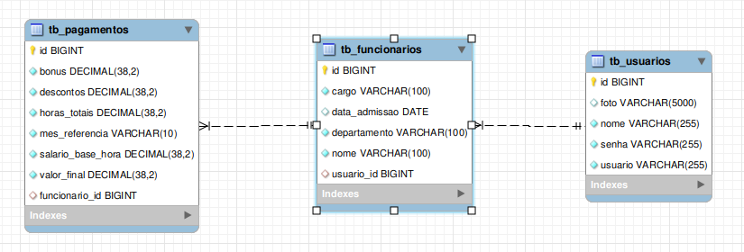

# NeoRH - Sistema de Gerenciamento de Recursos Humanos

Projeto desenvolvido como parte do Desafio 2 do Projeto Integrador do curso de Fullstack da Generation Brasil, com foco em criar uma aplicação funcional para auxiliar no gerenciamento de sistemas de RH em empresas de todos os portes.

## 👨‍👦‍👦 Descrição do Projeto

O NeoRH – Sistema de Gerenciamento de Recursos Humanos tem como propósito oferecer uma solução eficiente para controle das informações essenciais dos colaboradores de uma empresa. O sistema possibilita o registro, visualização, atualização e remoção de dados de funcionários de maneira simples e estruturada.

### 🎯 Objetivo

A aplicação foi idealizada para empresas de todos os portes, visando uma gestão mais eficiente e ágil de seus recursos humanos. O objetivo é facilitar o gerenciamento de equipes, inserção e remoção de funcionários e também automatizar cálculos financeiros referentes a salários, bônus e aumentos, promovendo maior agilidade, segurança e assertividade dos dados.

## 👥 Público-alvo

O público-alvo deste sistema são funcionários e gestores de equipes de RH, buscando agilizar e tornar o sistema mais eficiente.

## ❗ Problemas que o projeto visa resolver:

O sistema NeoRH foi desenvolvido para solucionar diversos desafios enfrentados pelas empresas na gestão de recursos humanos. Dentre as principais soluções oferecidas, destacam-se:
- Centralização e organização de dados
- Redução de erros e retrabalho
- Agilidade nos processos de RH
- Segurança e confidencialidade
- Facilidade de atualização e manutenção de informações
- Acessibilidade
- Suporte ao crescimento

Dessa forma, o NeoRH automatiza e moderniza o setor de RH, proporcionando um ambiente corporativo mais eficiente, seguro e preparado para os desafios do mercado atual.

## 🗃️ Entidades e Atributos

### Banco de dados (`db_sistema_rh`)

### Funcionários (`tb_funcionarios`)
- `id`: Identificador único
- `nome`: Nome completo
- `cargo`: Cargo do funcionário
- `departamento`: Departamento do funcionário na empresa
- `data_admissao`: Data de admissão do funcionário 
- `usuario_id`: Referência ao usuário do sistema associada ao funcionário (relacionamento)

### Usuário (`tb_usuario`)
- `id`: Identificador único
- `nome`: Nome completo do usuário
- `foto`: foto do usuário
- `senha`: senha de acesso ao sistema
- `usuario`: nome de usuário/login

### Pagamentos (`tb_pagamentos`)
- `id`: Identificador único do pagamento
- `bonus`: valor a ser pago de bônus
- `descontos`: valor a ser descontado do pagamento
- `horas_totais`: Total de horas a serem consideradas no pagamento
- `mes_referencia`: Mês ao qual se refere o pagamento
- `salario_base_hora`: Salário base por hora
- `valor_final`: Cálculo do valor final do pagamento
- `funcionario_id`: Referência ao funcionário associado ao pagamento

## 🔧 Funcionalidades (CRUD)

### Usuário
- **Criar**: Cadastrar novo usuário
- **Autenticar**: Autenticar usuário criando uma chave de acesso ao sistema
- **Listar**: Visualizar todos os usuários (filtro por ID)
- **Atualizar**: Editar informações de um usuário existente

### Funcionário
- **Criar**: Cadastrar novo funcionário
- **Listar**: Visualizar todos os funcionários (busca por nome e ID)
- **Atualizar**: Alterar informações de um funcionário
- **Excluir**: Deletar cadastro de funcionário na base de dados

### Pagamento
- **Criar**: Criar novo pagamento
- **Listar**: Exibir todos os pagamentos referentes a determinado funcionário, tendo como opções de busca o mês de referência e ID.
- **Atualizar**: Alterar dados de um pagamento registrado
- **Excluir**: Deletar cadastro de pagamento registrado

## 💻 Tecnologias Utilizadas

| Tecnologia      | Descrição                                           |
|-----------------|-----------------------------------------------------|
| Java            | Linguagem principal do backend                      |
| Spring Boot     | Framework para desenvolvimento web                  |
| MySQL           | Banco de dados relacional                           |
| JPA/Hibernate   | ORM para mapeamento objeto-relacional               |
| Maven           | Gerenciador de dependências                         |
| Insomnia        | Testes de endpoints RESTful                         |
| Trello          | Organização e gerenciamento das tarefas do projeto  |
| Discord         | Para comunicação da equipe                          |

## 🧪 Testes com Insomnia/Postman

Um arquivo .yaml com as requisições já prontas está disponível na pasta insomnia.
Basta importar no Insomnia/Postman e começar a testar!

## ▶️ Como Rodar o Projeto
1. Clone o repositório
2. Configure o banco de dados MySQL no arquivo application.properties:
    Abra o arquivo src/main/resources/application.properties e configure os parâmetros de conexão com o banco de dados MySQL de acordo com o que está configurado no seu ambiente local:

    spring.datasource.url=jdbc:mysql://localhost:3306/sistema_rh-backend
    spring.datasource.username=seu_usuario       # Substitua 'seu_usuario' pelo nome de usuário do MySQL da sua máquina
    spring.datasource.password=sua_senha         # Substitua 'sua_senha' pela senha do usuário do MySQL na sua máquina
    spring.jpa.hibernate.ddl-auto=update
    spring.jpa.show-sql=true

Importante: Lembre-se de substituir seu_usuario e sua_senha pelos dados corretos do MySQL configurados na sua máquina.

3. Execute a aplicação:
    Pela IDE:
    - Abra o arquivo SistemaRhBackendApplication.java (classe principal do Spring Boot).

    - Clique com o botão esquerdo do mouse em cima do arquivo.

    - Procure e clique na opção Run Java para rodar a aplicação.

## 👨‍💻 Integrantes do Grupo

| Nome              | Função         | GitHub                                   |
|-------------------|----------------|-------------------------------------------|
| Camila Lima       | Desenvolvedora | [camilalimas](https://github.com/camilalimas)|
| João Andrade      | Desenvolvedor  | [JoaoAndrade-dev](https://github.com/JoaoAndrade-dev)|
| Karina Camargo    | Tester         | [araujokahh](https://github.com/araujokahh)|
| Luan Lazarine     | Desenvolvedor  | [Lazarine1996](https://github.com/Lazarine1996)|
| Pamela Oliveira   | Product Owner  | [heypamela](https://github.com/heypamela)|
| Vitor Teles       | Desenvolvedor  | [VitorGabrielTeles](https://github.com/VitorGabrielTeles)|

📅 Projeto iniciado em: **25/04/2025**

---

## 📌 Observações

Este projeto é voltado para fins educacionais e representa uma solução inicial que pode ser expandida com outras features no futuro.

---
